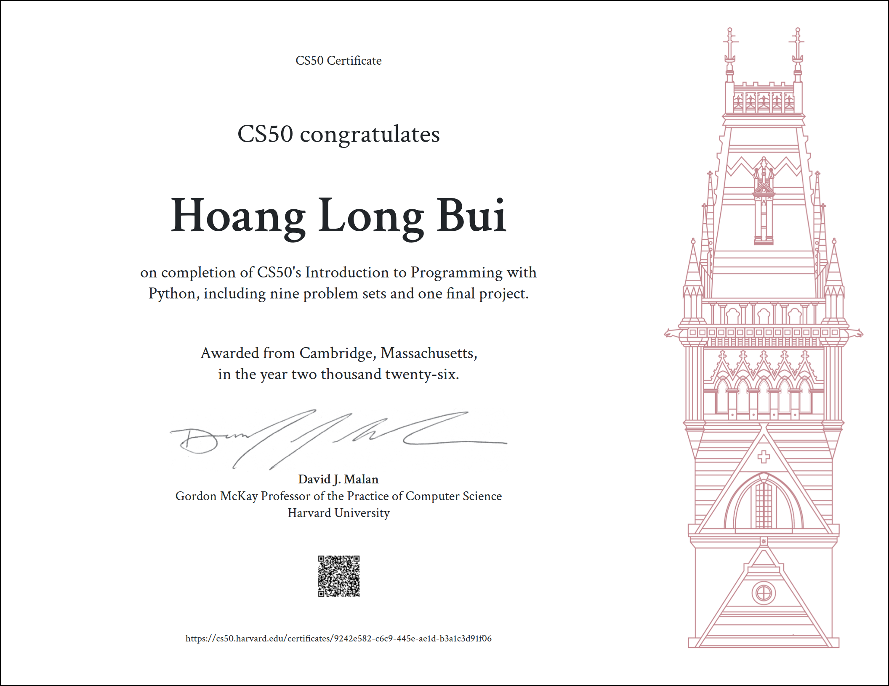

# Welcome to Aeron's Repository

## Overview

My name is Aeron.

I worked in the blockchain industry for around 5 years, but recently, I discovered that I'm really passionate about AI and building with AI.

That's why I decided to start this journey.

My plan is to learn coding from the basics first, then gradually move deeper into AI. The end goal is to become an AI engineer.

This repository is where I'm documenting my learning journey and keeping track of the things I build along the way.

## What's in This Repo

Here's a quick overview of what I have in this repository for now. I'll keep updating it as I learn and build more.

## 1. `fastapi-pnl`

This is the main project I'm currently working on.

**Live demo v1.0:** https://crypto-pnl-api.onrender.com/docs

### What It Is

My end goal for this project is to build an all-in-one tracker for a crypto portfolio.

The idea came from my experience working in the blockchain industry. I realized that it can be very difficult to track all your positions, especially when everything is separated across different places such as DEXs, CEXs, and multiple wallets.

That's why this project was born.

### Features

For v1.0, users can now access three public endpoints:

* GET `/`
* GET `/about`
* GET `/price/{coin_id}`

The `/price/{coin_id}` endpoint allows users to get the real-time price of any coin using the CoinGecko API.

There are also 5 other endpoints, but they are currently protected with an API key and are not open to the public yet:

* POST `/transaction`
* GET `/transactions`
* GET `/transactions/{id}`
* DELETE `/transactions/{id}`
* PUT `/transactions/{id}`

### Tech Stack

* **Framework:** FastAPI
* **Database:** PostgreSQL
* **Testing:** Pytest
* **CI:** GitHub Actions
* **Frontend:** Streamlit
* **Deployment:** Render + Docker

[More details](fastapi-pnl/README.md)

## 2. `streamlit-pnl`

This is where I'm building the frontend for the `fastapi-pnl` project above.

For now, there are three main actions available on the UI:

* **Get Price**: Uses the `/price/{coin_id}` endpoint to get the real-time price of a coin.
* **Show All Transactions**: Shows all transactions currently stored in the database.
* **Add Transaction**: Allows users to log a new transaction.

It's still running locally for now, but a public UI is coming soon!

## 3. `CS50P`

The `week-1` to `week-4` folders are where I documented my learning journey through CS50P, Harvard's Introduction to Programming with Python.

The earlier weeks are mainly focused on learning the basics of Python and solving the course problems.

In `week-4`, I stored my final project.

My CS50P final project is actually based on the same idea as `fastapi-pnl`, but with more features. It can calculate the average entry price for each position as well as the overall ROI of the portfolio.

Since the project only runs locally, I decided to build `fastapi-pnl` as a separate project. This gave me a chance to learn more about APIs while also making part of the project available for people to try publicly.

[More details about the Crypto P&L Tracker CS50P Final Project](week-4/README.md)

## CS50P Certificate

## More About Me

* **X:** https://x.com/Aeronn_11
* **DEV Community:** https://dev.to/aeronn_11
